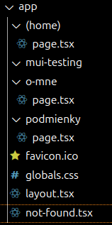
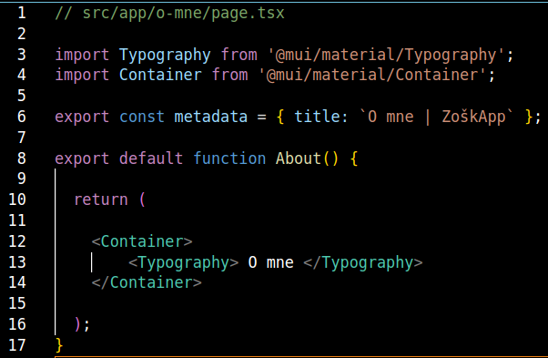

<h1>Poznamky NextJS na Ubuntu</h1>

<b>ls</b> – zobrazenie directories

<b>cd ~/Dokumenty/dev</b> – zmenenie directory z root na Dokumenty/dev

<b>npx create-next-app@latest</b> – vytvorenie NextJS aplikacie na najnovsiu verziu

<b>npm run dev</b> – spustit stranku

<b>npm install @mui/material @emotion/react @emotion/styled</b> – instalacia material ui do node projektu

<b>npm install @fontsource/roboto</b> – instalacia roboto fontu

<h2>19.09.2024</h2>

## Zanechavat komentare!!!!

Priklad zakladnej struktury stranky (front-end)

Tato suborova struktura v NextJS zarucuje routing (smerovanie)

Domovska podstranka sa zakladne nachadza v app priecinku ale moze sa pridat aj do priecinka (home)

Na to aby sme vytvorili novy subpage, je potrebne si v app priecinku vytvorit novy priecinok lubovolnym nazvom. V tomto priecinku je potrebne vytvorit subor page.tsx kde budeme pridavat cely obsah podstranky 

K podstranke si mozeme vytvorit aj layout.tsx kde budeme pridavat zakladny layout podstranky

Mame este specialny typ subpage subor not-found.tsx kde pridavame to co sa bude zobrazovat ked do browsera zadame subpage ktory sa nenachadza na nasej stranke

Nazvy suborov su striktne dane a nesmu sa menit!

Zakladna struktura suboru podstranky
