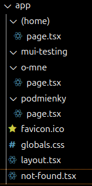

<b>Poznamky NextJS na Ubuntu</b>

ls – zobrazenie directories

cd ~/Dokumenty/dev – zmenenie directory z root na Dokumenty/dev

npx create-next-app@latest – vytvorenie NextJS aplikacie na najnovsiu verziu

npm run dev – spustit stranku

npm install @mui/material @emotion/react @emotion/styled – instalacia material ui do node projektu

npm install @fontsource/roboto – instalacia roboto fontu

import Typography from '@mui/material/Typography'; - importovanie tagu Typography (nahradza paragraph/
)

Struktura <Typography> tagu: 
<Typography variant="h4" >
	h4. Heading
</Typography>

